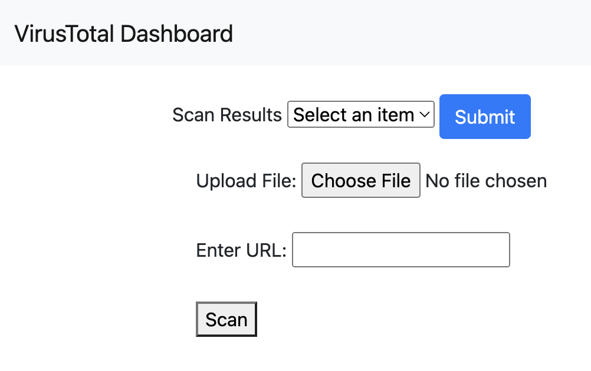
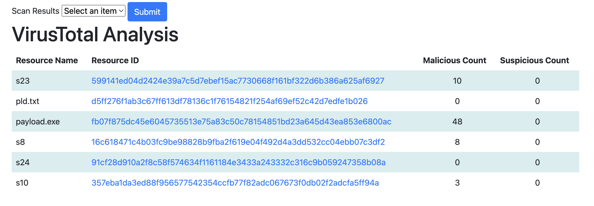
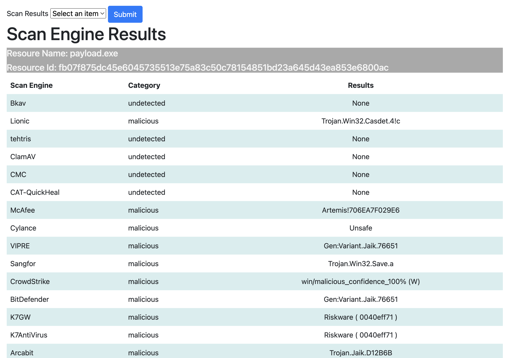

### Install Dependencies

- pip install -r requirements.txt

### Setup Flask App

- Create a `.env` and set the `API_KEY` to your virustotal api key.
- python app.py

### Setup DB

- flask shell
- from models import db, Analysis
- db.create_all()

### VT Analysis Dashboard

### Scan Resource

### Scan Results

### Scan Engine Results

